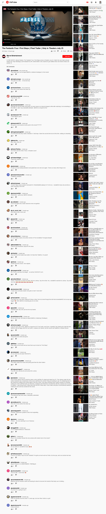

## 🎯 Project Overview

youtube-app is a fast, modern video streaming web app built with **React** and **Vite** that fetches and displays real-time video content using the **YouTube Data API (via RapidAPI)**.

## 💡 Key Features

- 🎥 Browse trending videos by category
- 🔎 Search and watch any YouTube video
- 📺 Responsive video player with detailed metadata
- 🧭 Dynamic routing for channels and video pages
- ⚡ Built with Vite for fast development and hot reloading
- 🛡️ API key handling via environment variables

## 🛠️ Technologies Used

- **React 18** — UI Library
- **React Router** — Client-side routing
- **Vite** — Lightning-fast bundler and dev server
- **RapidAPI (YouTube Data API v3)** — Video data source
- **CSS Modules** — Component-scoped styling
- **Render.com** — Cloud deployment platform

## 📸 Screenshots

  

